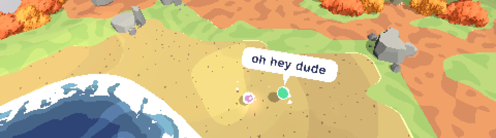

  

  <h1>👋 Kumusta Ka! 👋</h1>
  
  
  
  
  
  

###

I'm a student studying Computer Science at Northwestern University's McCormick School of Engineering and Applied Science.
* ⌨️ I love developing video games, creating software tools, and writing firmware.
* 🚗 I am on Northwestern's Formula Team, where I work on the Data Aquisition Subteam.
* 👨‍🔬 I am a web developer at Northwestern's CCL Lab, where I aid in the development of Morfli, a learning enviornment for Material Science.
* 🎨 In my freetime, I enjoy creating art and powerlifting (S:375, B:255, D:455).

## 🚧 Current Projects 🚧
Outside of school and work, I spend my freetime working on:
* ➰ [Curly](https://github.com/Evan-Bertis-Sample/Curly) : A lightweight Unity framework that provides foundational game-development systems, whilst pushing for a loosely-coupled code architecture.
* 📂 [DAQ-Serializer](https://github.com/NU-Formula-Racing/daq-serializer-24) : A serialization protocol and library intended to use in Northwestern's Formula Car's data-relay systems, with the objective of minimizing data bloat and maximizing flexibility.
* 🍂 [Lost In Leaves](https://github.com/Evan-Bertis-Sample/cs376-lost-in-leaves) : A cozy puzzle game being developed in Unity with the use of Curly.

## 🛠️ Tools and Technologies 🛠️

